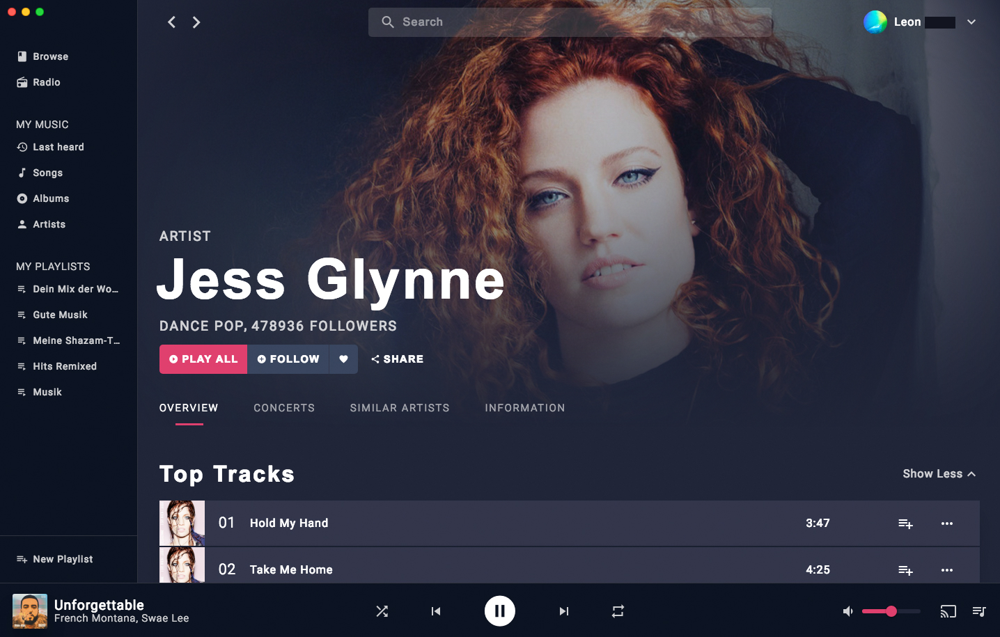
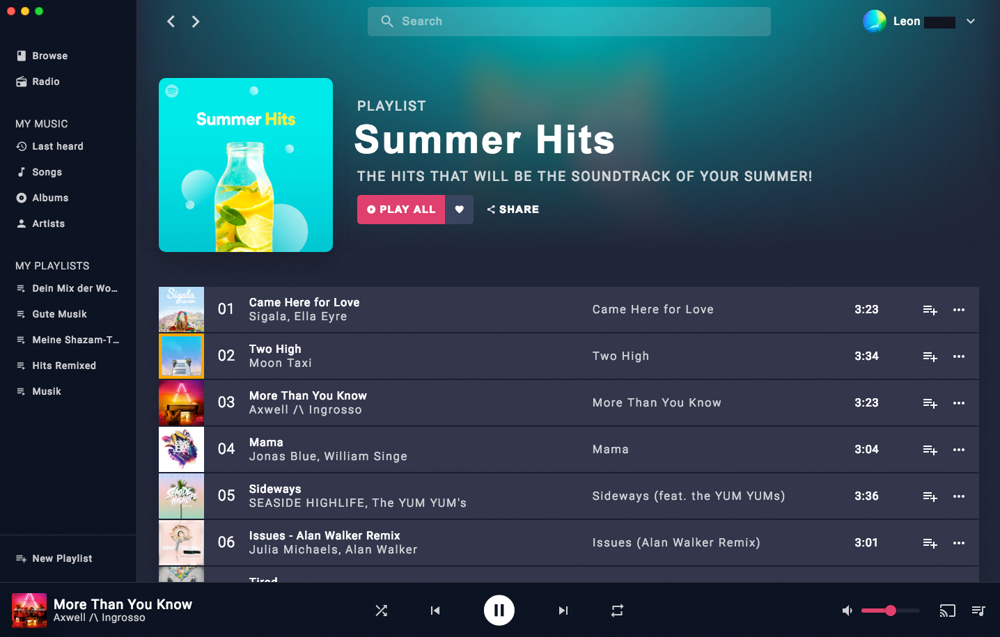

# music-app-electron

> Music-Streaming app built with Electron, Webpack, Vue.js, Vuex and the Spotify api.




## How to setup dev environment

``` bash
# clone this repository
git clone https://github.com/microeinhundert/music-app-electron

# go into project folder
cd music-app-electron

# install dependencies
npm i

# serve with hot reload at localhost:8080
npm run dev

# build for production with minification
npm run build
```
## Setup Spotify API

While in development you have to set your access token manually.

Go to https://developer.spotify.com/web-api/console/post-next/ and click on "GET OAUTH TOKEN".
Next grant the app all permissions, it needs them for getting your playlists and control your playback.
After you got your access token go to "music-app-electron/src/renderer/api/index.js" and insert it on line 8.
That's it, now you can start the app by typing "npm run dev" in your console.

Remember to repeat the above steps every 60 minutes to prevent your access token from expiring.
For now these steps are necessary until an automatic auth process will be implemented in the future.
